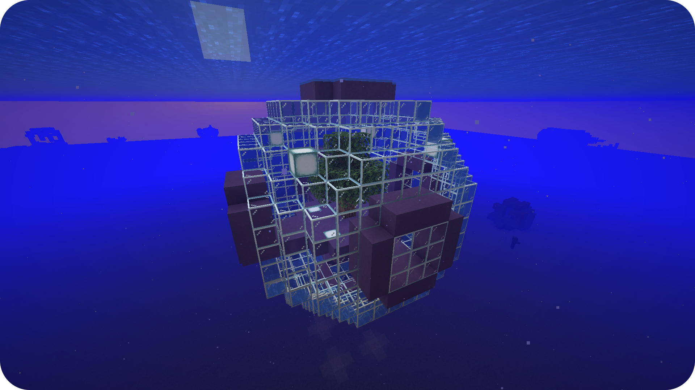

# Seablock


_[Download](https://github.com/MelanX/SkyblockBuilder/raw/gh-pages/assets/examples/downloads/1.16.x/seablock.zip)_

To create a seablock like modpack, you can simply set the surface settings as you can see in the config below.

`config/skyblockbuilder/common-config.json5`:
```json
{
  "World": {
    "surface": true,
    "surfaceSettings": "minecraft:bedrock,100*minecraft:sandstone,4*minecraft:sand,23*minecraft:water"
  }
}
```

I added a lot of sandstone layers for the image. Additionally, in the download are a few more things changed. A few
features and structures are enabled, too. The spawn height was changed to set the top of the island on top of the water
layers.

Here you can also see the single biome option.

This example also contains the feature of multiple templates where you can see how to set it up correctly.

Thanks to [benbenlaw 🔗](https://www.curseforge.com/members/benbenlaw/projects) for giving me permission to use the 
templates from his well known modpack [Seaopolis 🔗](https://www.curseforge.com/minecraft/modpacks/seaopolis) for this
example.