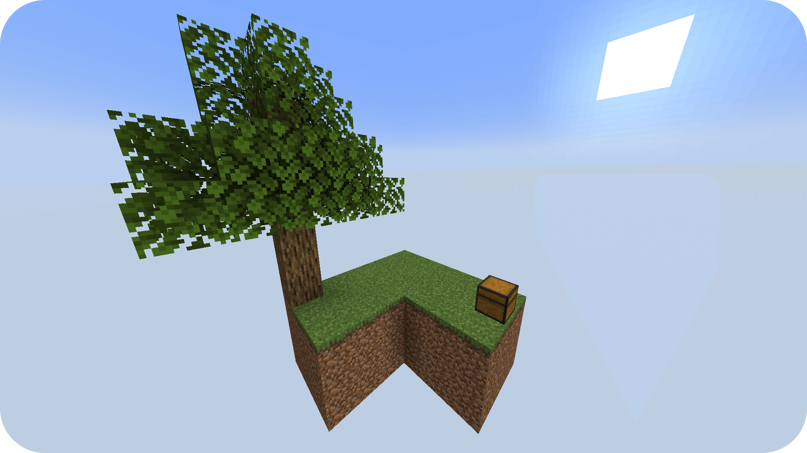

# Skyblock

This is the default island when using the mod. You don't have to adjust any config for this. Just use it.

If you want another starting island, just replace the file `config/skyblockbuilder/templates/default.nbt` and adjust
the [spawns](../packdev/packdev.md#configuring-templates).

_The next examples will contain downloads with all changed things._