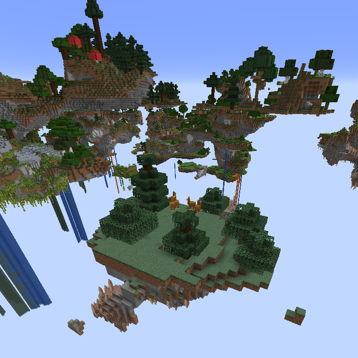

# World Types
Skyblock Builder adds not only one world type, but also a second one!

## Skyblock
The first world type is called **Skyblock**. It is a world where you can customize the starting island.
The config and all options are for this world type only.

You can use this world type on servers or in `forge-common.toml` by using `skyblockbuilder:skyblock`.

## Skylands
The second world type is called **Skylands**. It is a world where you can travel over floating islands in a land
with mostly sky. There's currently no config for this world type. It's mainly for testing at the moment.

This world type is heavily inspired by mods like [SkyLandsForge](https://www.curseforge.com/minecraft/mc-mods/skylandsforge).
The generation for this is based on an Aether mod for Fabric called [Paradise Lost](https://github.com/devs-immortal/Paradise-Lost/blob/a7c7cebc770be2ca0e9ba1b2113686df67916fea/src/main/resources/data/the_aether/worldgen/noise_settings/aether_noise.json).
This mod is licensed under the [MIT license](https://github.com/devs-immortal/Paradise-Lost/blob/a7c7cebc770be2ca0e9ba1b2113686df67916fea/LICENSE.md).

You can use this world type on servers or in `forge-common.toml` by using `skyblockbuilder:skylands`.

