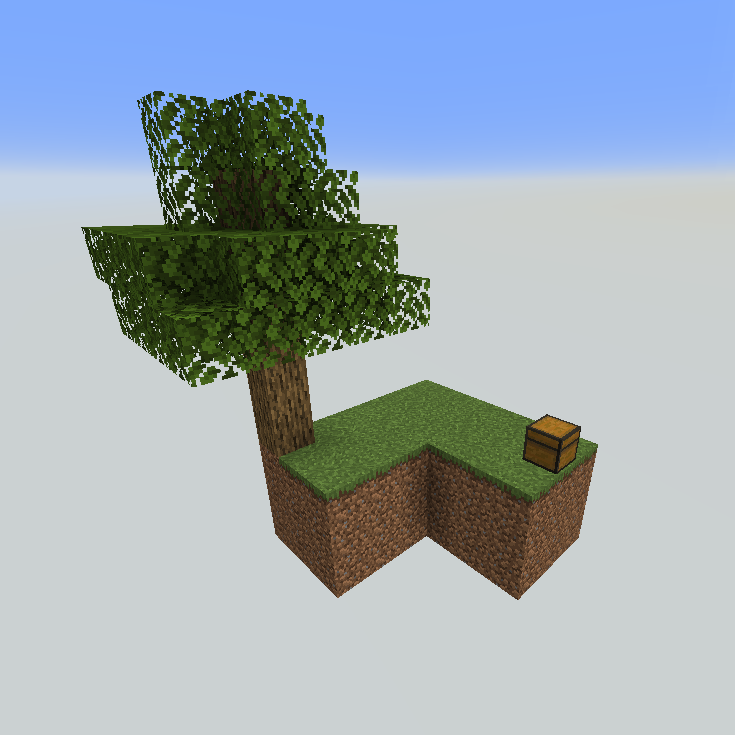

# World Types

## Skyblock
The only world type added is called **Skyblock**. It is a world where you can customize the starting island.

You can use this world type on servers by using `skyblockbuilder:skyblock`.

